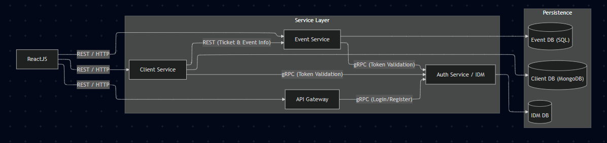

# EventFlow — Artistic Event Management Platform


A microservices-based platform for managing artistic events, event packages, tickets, and clients. Academic project.

---

## Architecture



The system is composed of five independent services plus a React frontend, all containerized with Docker Compose.

```
ReactJS
  │
  ├─ REST/HTTP ──► API Gateway (FastAPI, :8000)
  │                    │
  │                    └─ gRPC ──► Auth Service / IDM (Python, :50051)
  │                                    └─ IDM DB (MariaDB, :3307)
  │
  ├─ REST/HTTP ──► Event Service (Java Spring Boot, :8080)
  │                    ├─ gRPC ──► Auth Service / IDM
  │                    └─ Event DB (MariaDB, :3308)
  │
  └─ REST/HTTP ──► Client Service (Kotlin Spring Boot, :8081)
                       ├─ gRPC ──► Auth Service / IDM
                       ├─ REST ──► Event Service (ticket validation)
                       └─ Client DB (MongoDB, :27018)
```

**Communication patterns:**
- **REST/HTTP** — frontend ↔ gateway and frontend ↔ backend services
- **gRPC (Unary RPC)** — all services → IDM for token validation; gateway → IDM for login/register
- **JWT (HS256)** — stateless auth tokens with `role`, `sub`, `jti` claims; blacklist maintained in IDM

---

## Microservices

### 1. `serviciu_idm` — Identity Management (Auth Service)
**Stack:** Python · gRPC · SQLAlchemy · MariaDB · bcrypt · PyJWT

The IDM service is the single source of truth for authentication and authorization. It speaks **gRPC only** — no REST API.

| gRPC Method | Input | Output | Description |
|---|---|---|---|
| `Authenticate` | email + password | JWT token | Login |
| `ValidateToken` | JWT string | sub + role | Validate & decode token |
| `InvalidateToken` | JWT string | success | Logout / blacklist token |
| `CreateUser` | email + password + role | user info | Admin creates users |

**Key details:**
- Tokens: HS256, configurable expiry, include `iss`, `sub`, `exp`, `iat`, `jti`, `role`
- Blacklist: in-memory (or H2/dict) for invalidated tokens
- Passwords: bcrypt-hashed
- DB table: `users(id, email, password_hash, role)` — roles: `admin`, `owner-event`, `client`
- Entry: `serviciu_idm/src/server.py` · Models: `models.py` · JWT logic: `jwt_service.py`

---

### 2. `serviciu_bilete` — Events & Tickets Service
**Stack:** Java 21 · Spring Boot 3.2 · Spring Security · JPA/Hibernate · MariaDB · gRPC client · OpenAPI/Swagger 

Manages events, event packages, and tickets. All mutating endpoints require a valid JWT.

**Data model (MariaDB):**

```
EVENIMENTE (id PK, id_owner, nume UK, locatie, descriere, numarLocuri)
PACHETE     (id PK, id_owner, nume UK, locatie, descriere)
JOIN_PE     (pachetId PK FK, evenimentId PK FK, numarLocuri)   ← package-event M:M
BILETE      (cod PK, pachetId FK, evenimentId FK)              ← ticket
```

**REST endpoints** (base: `/api/event-manager`):

| Route | Description |
|---|---|
| `GET/POST /events` | List (filter by name, location, numarLocuri) / Create event |
| `GET/PUT/DELETE /events/{id}` | Read / Update / Delete event |
| `GET/POST /event-packets` | List (filter by type, available_tickets) / Create package |
| `GET/PUT/DELETE /event-packets/{id}` | Read / Update / Delete package |
| `GET/POST /events/{id}/event-packets` | Packages for an event |
| `GET/POST /event-packets/{id}/events` | Events in a package |
| `GET/POST /tickets` | List / Create (buy) ticket |
| `GET/DELETE /tickets/{cod}` | Read / Invalidate ticket |
| `GET /events/{id}/tickets` | Tickets for an event |
| `GET /event-packets/{id}/tickets` | Tickets for a package |
| `POST /auth/login` · `POST /auth/logout` | Proxy to IDM via gRPC |

**Security:** `JwtAuthenticationFilter` intercepts every request. GET is public; POST/PUT/DELETE require `Authorization: Bearer <JWT>`. The filter calls the IDM gRPC `ValidateToken` to extract `sub` (owner ID) and `role`, then `AuthorizationHelper` enforces ownership/role rules. `id_owner` is populated from the JWT `sub` claim at creation time.

**Business rules enforced:**
- Ticket count for an event cannot exceed `numarLocuri`
- Package's available seats = min of constituent events' seats
- Cannot change `numarLocuri` after at least one ticket has been sold
- Ticket codes auto-generated as `BILET-{UUID}`
- HATEOAS `_links` (self, parent) on all resource representations

OpenAPI docs: `GET /v3/api-docs` (JSON) · Swagger UI: `/swagger-ui.html`

---

### 3. `serviciu_clienti` — Clients Service
**Stack:** Kotlin · Spring Boot 3.4 · Spring WebFlux · MongoDB · gRPC client · OpenAPI/Swagger

Manages client profiles and their purchased tickets. Clients are stored as flexible MongoDB documents.

**Data model (MongoDB collection: `clients`):**

```json
{
  "_id": ObjectId,
  "idmUserId": 42,
  "email": "unique string",
  "prenume": "string (optional)",
  "nume": "string (optional)",
  "dateSuntPublice": false,
  "linkuriSocialMedia": { "instagram": "...", "twitter": "..." },
  "bileteAchizitionate": ["BILET-abc123", "BILET-def456"]
}
```

**REST endpoints** (base: `/api/clients`):

| Route | Description |
|---|---|
| `GET /clients` | List (filter by email, paginated) |
| `POST /clients` | Create client |
| `GET/PUT/DELETE /clients/{id}` | Read / Update / Delete client |
| `POST /clients/{id}/bilete` | Purchase ticket (calls Event Service) |
| `GET /clients/{id}/bilete` | List client's tickets (with full event/package info) |
| `DELETE /clients/{id}/bilete/{cod}` | Return / invalidate ticket |

**Key behaviours:**
- Purchasing a ticket: calls `serviciu_bilete` REST to create the ticket there, then stores the code locally
- Returning a ticket: calls `serviciu_bilete` REST to delete/invalidate, then removes from local list
- Deleting a client with active tickets is forbidden
- `dateSuntPublice = true` exposes name fields to `owner-event` role users
- Same JWT filter + IDM gRPC validation as `serviciu_bilete`

OpenAPI docs: `GET /v3/api-docs` · Swagger UI: `/swagger-ui.html`

---

### 4. `serviciu_gateway` — API Gateway
**Stack:** Python · FastAPI · httpx · gRPC client · Uvicorn

The single entry point for the frontend. Handles auth operations directly via gRPC to IDM and can proxy other requests.

**Endpoints** (port `8000`):

| Route | Description |
|---|---|
| `POST /api/auth/login` | Authenticate via IDM gRPC, return JWT |
| `POST /api/auth/logout` | Invalidate token via IDM gRPC |
| `POST /api/auth/register` | Create user via IDM gRPC (admin only) |
| `POST /api/auth/validate` | Validate token via IDM gRPC |
| `GET /health` | Health check |

**Features:** CORS configured for both local dev (`localhost:*`) and production, Pydantic request/response models, env-variable-driven service discovery.

---

### 5. `serviciu_frontend` — React SPA
**Stack:** React 19 · TypeScript · Vite · Nginx (production)

Single-page application served by Nginx on port 80. In development, Vite dev server proxies to `localhost:8000–8081`.

**Pages / views:**
- **Login** — JWT login via gateway
- **Events list** — browse/filter all events (name, location, seats)
- **Event detail** — view event, associated packages, tickets
- **Event form** — create / edit event (owner-event role)
- **Packages list / detail / form** — manage event packages
- **My Events / My Packages** — owner's own resources
- **My Tickets** — client's purchased tickets
- **Client Profile** — manage personal info, social links

**Key files:**
- `src/api/index.ts` — all API calls (authApi, eventsApi, packagesApi, ticketsApi, clientsApi)
- `src/context/AuthContext.tsx` — global auth state (JWT token + user role)
- `src/App.tsx` — routing and layout

---

## Role Permissions

| Role | Capabilities |
|---|---|
| **guest** | Browse events and packages (read-only, no login required) |
| **admin** | Create users (owner-event or client); no access to event/client data |
| **owner-event** | Full CRUD on own events/packages; view public client info of own ticket buyers; view other owners' events (read-only) |
| **client** | Manage own profile; buy/view/return tickets; browse events and packages |

---

## Repository Structure

```
              
├── scripts/
│   ├── populate_data.py          ← seed events, packages, users
│   ├── init_db.py                ← docker one-time init job
│   └── Dockerfile
├── serviciu_idm/
│   ├── proto/idm.proto
│   └── src/
│       ├── server.py             ← gRPC server entry point
│       ├── jwt_service.py
│       ├── models.py             ← SQLAlchemy User model
│       └── client.py             ← dev test client
├── serviciu_bilete/
│   └── src/main/java/com/pos/
│       ├── controller/           ← EvenimentController, PachetController, BiletController, AuthController
│       ├── service/              ← business logic
│       ├── models/               ← JPA entities
│       ├── security/             ← JWT filter, IDM gRPC client, AuthorizationHelper
│       └── proto/idm.proto
├── serviciu_clienti/
│   └── src/main/kotlin/com/pos/serviciu_clienti/
│       ├── controller/           ← ClientController
│       ├── service/              ← ClientService, EventsServiceClient
│       ├── model/                ← Client (MongoDB document)
│       └── security/             ← JWT filter, IDM gRPC client
├── serviciu_gateway/
│   ├── proto/idm.proto
│   └── src/gateway.py
└── serviciu_frontend/
    └── src/
        ├── api/index.ts
        ├── context/AuthContext.tsx
        ├── components/           ← EventList, EventForm, PackageList, Login, MyTickets, …
        └── App.tsx
```

---

## How to Run

### Prerequisites

- [Docker](https://docs.docker.com/get-docker/) ≥ 24
- [Docker Compose](https://docs.docker.com/compose/) ≥ 2.20 (included with Docker Desktop)

### 1. Clone the repository

```bash
git clone https://github.com/robeery/event-flow
```

### 2. Start all services

```bash
docker compose up --build
```

This builds all images and starts:

| Service | URL |
|---|---|
| Frontend (React) | http://localhost |
| API Gateway | http://localhost:8000 |
| Events Service (Swagger) | http://localhost:8080/swagger-ui.html |
| Clients Service (Swagger) | http://localhost:8081/swagger-ui.html |
| IDM (gRPC only) | localhost:50051 |

The `db-init` container automatically seeds the databases with sample users, events, and packages on first run.

### 3. Seed data (optional, local)

To re-populate data while services are running:

```bash
cd scripts
pip install requests
python populate_data.py
```

### 4. Default credentials

The seed script creates the following users (adjust in `scripts/populate_data.py`):

| Email | Password | Role |
|---|---|---|
| `admin@eventflow.com` | `admin123` | admin |
| `owner1@eventflow.com` | `owner123` | owner-event |
| `client1@eventflow.com` | `client123` | client |

### 5. Stop services

```bash
docker compose down
```

To also remove the database volumes:

```bash
docker compose down -v
```

---

## Technology Summary

| Service | Language | Framework | Database | Protocol |
|---|---|---|---|---|
| IDM | Python 3.11 | gRPC / SQLAlchemy | MariaDB | gRPC |
| Events & Tickets | Java 21 | Spring Boot 3.2 | MariaDB | REST + gRPC client |
| Clients | Kotlin (JVM 21) | Spring Boot 3.4 | MongoDB | REST + gRPC client |
| Gateway | Python 3.11 | FastAPI | — | REST + gRPC client |
| Frontend | TypeScript | React 19 / Vite | — | REST / CORS/FETCH |

